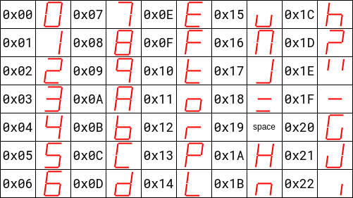
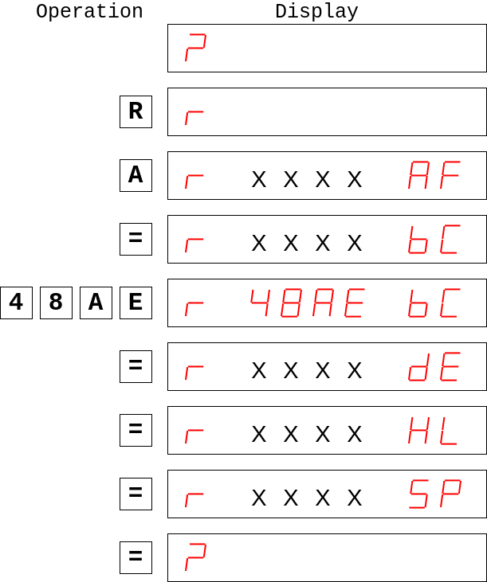

# Educational single-board computer PMI-80

## Description of MONITOR operating system

MONITOR OS 

## Memory and interface addressing

Chip select signals CS0, CS1 and CS7 are used to select onboard memories. CS0 selects ROM with MONITOR, CS1 selects user ROM and CS7 selects RAM.
The RAM is divided to two areas:
 - 0x1C00 to 0x1FD8 for user
 - 0x1FD9 to 0x1FFF is reserved for MONITOR

On the following image is the memory map:





## MONITOR commands

Keys `RE` and `I` are directly connected to hardware, they do not generate any key code.

### Command  definition syntax

- parameters in **<>** are mandatory
- 
### `RE` - system initialization (RESET)
When you press the `RE` key the system is initialized. Processor 8080A starts by reading instruction on address 0000h which means that **MONITOR** starts. **MONITOR** initializes, sets the stack pointer to the top and displays a welcome message:

<!---

--->


The message can be confirmed by pressing any key. Then the '?' sign appears, which means that the **MONITOR** is ready to accept a command.


### `INT` - external interrupt

By pressing the key `INT` you request external interrupt. If the external interrupt is enabled the processor jumps to the address 0x0038 and saves the return address to the stack (like by instruction 'RST 7').
On the address 0x0038 is jump instruction to the address 0x1FE6 where the user must place its own interrupt vector to the interrupt routine. There are 3 byte left for this vector.

### `REG` - CPU registers modification

Command:

`R` \<register\> <(data)> `=`

With `R` command you can view or modify the content of CPU registers. When the comand is isued the following display should appear:


Now you can press `A`, `B`, `D`, `8` or `9` to display content of corresponding register pair AF, BC, DE, HL, SP. Now you can also modify the register pair. By pressing `=` key you finish current register pair opperations and advance to the following register pair. After the SP regiter manipulation and presing `=` the MONITOR enters command waiting state with '?' display.

Example - registers examination and modification of BC to value 0x48AE:



### `MEM` - memory modification

Command:

`M` \<(address)\> `=` <(data)> `=` ...

With `M` command you can view or modify the content of the memory space. When the comand is isued the following display should appear:


Next to the 'M' sign is displayed last address. Now you can enter new address or keep current. By pressing `=` key you confirm the address and you can modify the value. Press `=` to store new data and go to next address and modify data or skip to next address by pressing `=`.

Example:

You want to add following code to address 0x1C00

```none
	Address		Data	Instruction
	0x1C00		0x21	LXI	H, 2200h
	0x1C01		0x00
	0x1C02		0x22
```


Solution:
```none
	LXI		H, 1D00h	; Nastavenie vyst. registra
	SHLD 	1FFCh		;
	MVI		A, 13h		;
	CALL	CLEAR		; 
```
