# Replica of single-board computer PMI-80

> this document is still a draft

<!--
<p align="center">
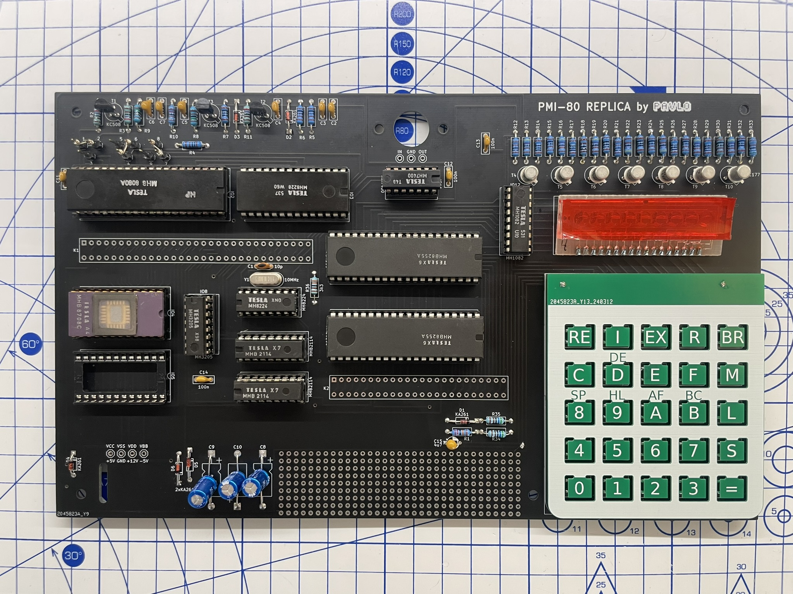
</p>
-->


The template for this replica was educational single-board computer from former Czechoslovakian republic produced in the 80s by Tesla company. I tried to use as many original Tesla parts as possible. The keyboard used in original was modified calculator keyboard from OKU-205. It is not possible to obtain it so I designed my own keyboard from two PCB, bottom with switches and top as a overlay. The replica also contains original MONITOR software. THe power supply must provide tree voltages +5V, -5V and +12V which is common for 8080 designs.

## Table of contents

* [About the original](#About-the-original)
	* [Features](#features)
* [Assembly procedure](#assembly-procedure)
* [MONITOR operating system](#MONITOR-operating-system)
	* [Memory and interface addressing](#memory-and-interface-addressing)
	* [MONITOR commands](#monitor-commands)
		* [Command  definition syntax](#command-definition-syntax)
		* [`RE` - system initialization (RESET)](#re---system-initialization-reset)
		* [`INT` - external interrupt](#int---external-interrupt)
		* [`REG` - CPU registers modification](#reg---cpu-registers-modification)
		* [`MEM` - memory modification](#mem---memory-modification)
		* [`GO` - program execution](#go---program-execution)
	* [MONITOR subroutines accesible by the user](#monitor-subroutines-accesible-by-the-user)
		* [`CLEAR` address 0x00AB](#clear-address-0x00ab)
		* [`ENTRY` address 0x0008](#entry-address-0x0008)
		* [`TIN` address 0x0300](#tin-address-0x0300)


## About the original

PMI-80 was educationl computer produced by Tesla Piešťany, Czechoslovakia since 1982. It was based on MHB8080A, the clone of Intel 8080. It used 9 digit 7-segment LED display and 25 key hexadecimal keypad. Clock frequency was 1.111 MHz. It had 1kB of ROM with "operating system" MONITOR. It was possible to add another 1kB of user ROM. Next it contained 1kB of RWM (Read–write memory).

<p align="center">
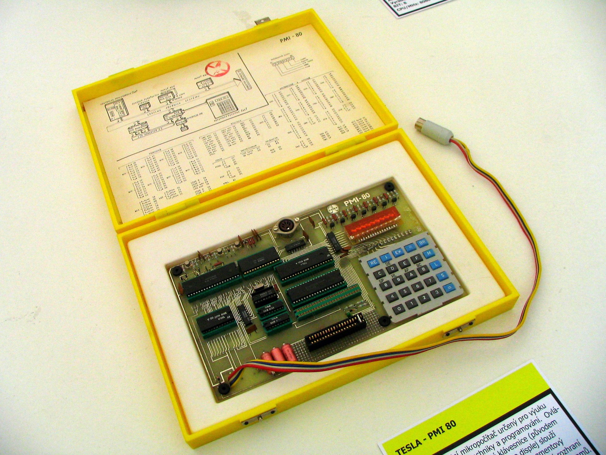
</p>

<div style="text-align: center">Original PMI-80, source: https://commons.wikimedia.org/w/index.php?curid=24581204</div>


### Features
* Integrated circuits:
	* 1× MHB8080A (microprocessor, equivalent of Intel 8080)
 	* 1× MH8224 (clock and reset generator)
 	* 1× MH8228 (system controller and bus driver)
 	* 1× MH3205 (3 to 8 decoder, equivalent of 74LS138, used for chip sellects)
 	* 2× MHB2114 (SRAM 1024×4b)
 	* 1× MHB8608 (PROM 1024×8b) or MHB8708 (EPROM 1024×8b)
 	* 1× MHB8255A (programmable peripheral interface)
 	* 1× MH1082 (decoder and driver of 7-segment LED display)
 	* 1× MH7400 (4× NAND)
 * Power supply
 	* external: +5V (V<sub>CC</sub>), -5V (V<sub>BB</sub>), 12V (V<sub>DD</sub>)
> **Caution** <br>
> -5V must be the first power source connected and the last disconnected. <br>
> +12V must be the last connected and first disconnected power source.

## Assembly procedure

This computer is delivered as a Kit so you must assembly it yourself.

I recommend this order of soldering parts to main PCB:

* all sockets for IOs
* diodes, transistors and crystal
* resistors and capacitors
* use short wires to mount LCD display

	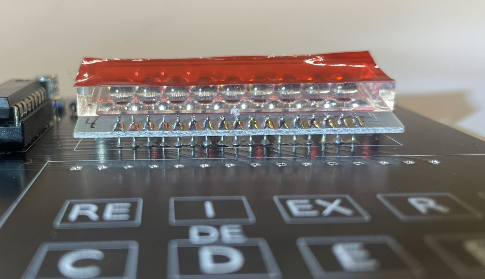

* Keyboard
	* solder all 25 switches to the bottom keyboard PCB
	* insert and solder extracted pins to main board

		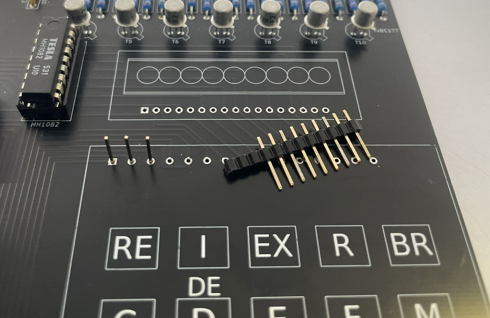
	
	* mount bottom keyboard PCB to pins

		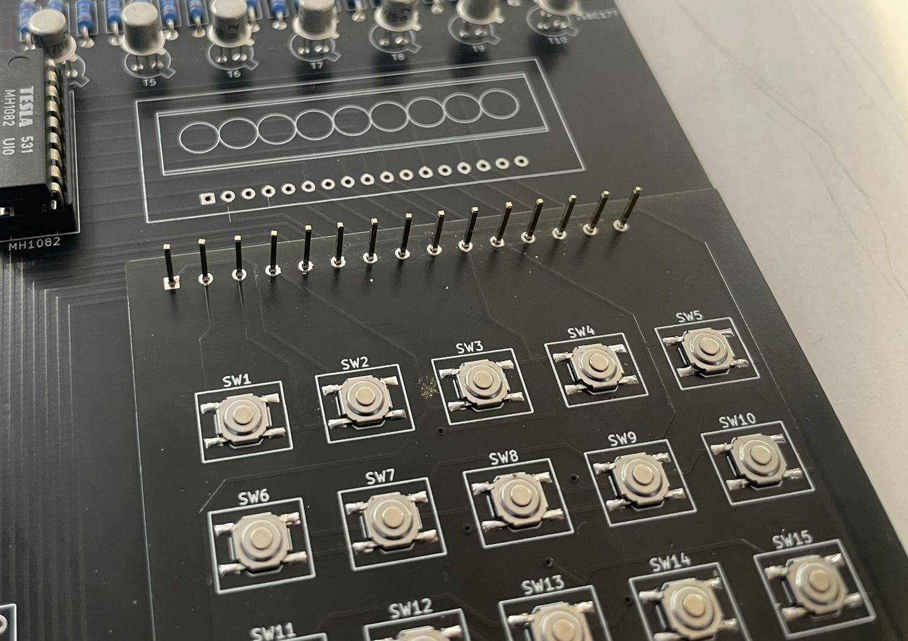

	* cut all pins except the outer ones

		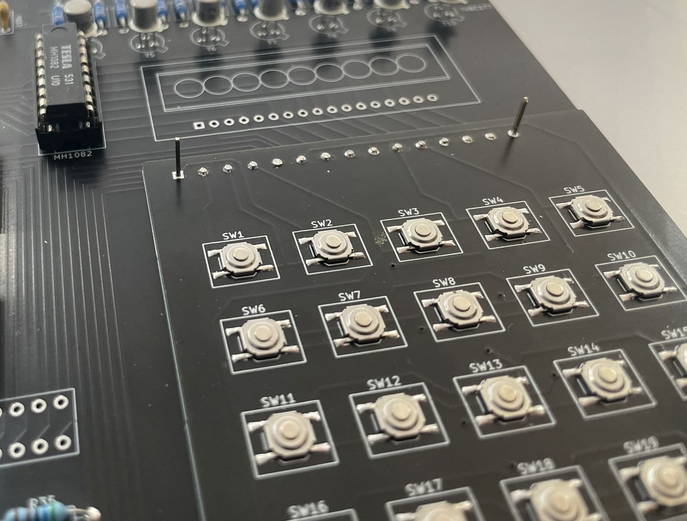

	* mount the upper PCB

		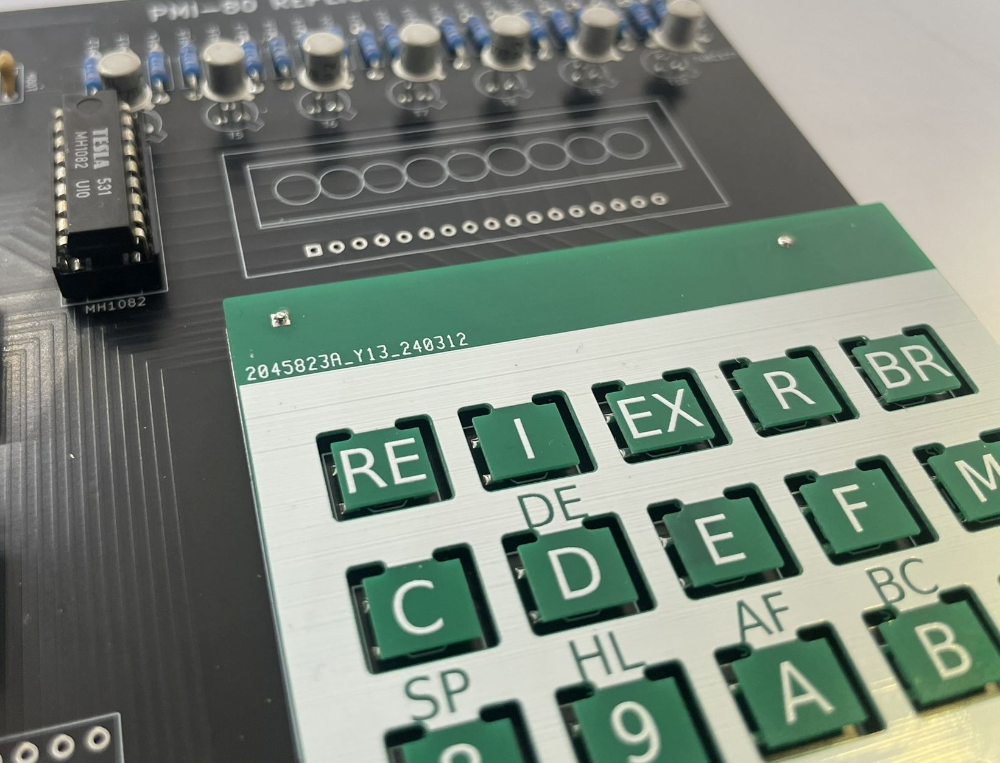

* short pins 1 to 9 according to the silkscreen on main PCB 

	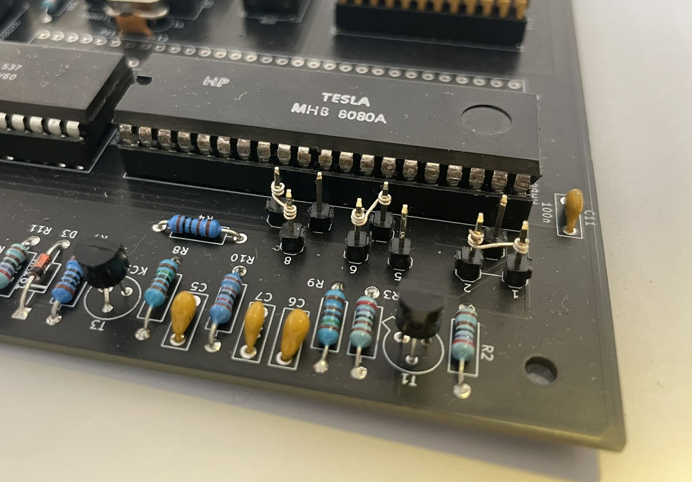

* connect power source with 5V, -5V and 12V

> **Caution** <br>
> -5V must be the first power source connected and the last disconnected. <br>
> +12V must be the last connected and first disconnected power source.

## MONITOR operating system

MONITOR is saved in 1kB PROM.

* system inicialisation
* register view/edit
* memory view/edit
* execution of user code
*

### Memory and interface addressing

Chip select signals CS0, CS1 and CS7 are used to select onboard memories. CS0 selects ROM with MONITOR, CS1 selects user ROM and CS7 selects RWM.
The RWM is divided to two areas:
 - 0x1C00 to 0x1FD8 for user
 - 0x1FD9 to 0x1FFF is reserved for MONITOR

On the following image is the memory map:


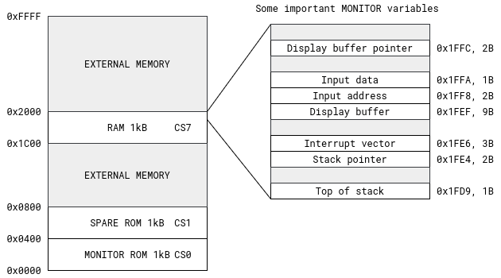

Figure 1. PMI-80 Memory map and some MONITOR variables

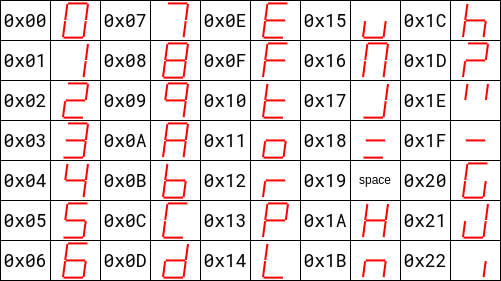

Table 1. Character codes saved in MONITOR

### MONITOR commands

Keys `RE` and `I` are directly connected to hardware, they do not generate any key code.

#### Command  definition syntax

- parameters in **< >** are mandatory
- parameter **address** is 2 bytes long memory address entered in hexadecimal
- parameter **data** is 1 byte long in hexadecimal
- parameters in **<( )>** are optional

#### `RE` - system initialization (RESET)
When you press the `RE` key the system is initialized. Processor 8080A starts by reading instruction on address 0000h which means that **MONITOR** starts. **MONITOR** initializes, sets the stack pointer to the top and displays a welcome message:

<!---

--->


The message can be confirmed by pressing any key. Then the '?' sign appears, which means that the **MONITOR** is ready to accept a command.


#### `INT` - external interrupt

By pressing the key `INT` you request an external interrupt. If the external interrupt is enabled the processor jumps to the address 0x0038 and saves the return address to the stack (like by instruction 'RST 7').
On the address 0x0038 is a jump instruction to the address 0x1FE6 where the user must place its own interrupt vector to the interrupt routine. There are 3 bytes left for this vector.

#### `REG` - CPU registers modification

Command:

`R` \<register\> <(data)> `=`

With `R` command you can view or modify the content of CPU registers. When the command is issued the following display should appear:

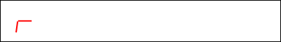

Now you can press `A`, `B`, `D`, `8` or `9` to display the content of corresponding register pair AF, BC, DE, HL, SP. Now you can also modify the register pair. By pressing `=` key you finish the current register pair operations and advance to the following register pair. After the SP register manipulation and pressing `=` the MONITOR enters the command waiting state with '?' display.

Example - registers examination and modification of BC to value 0x48AE:

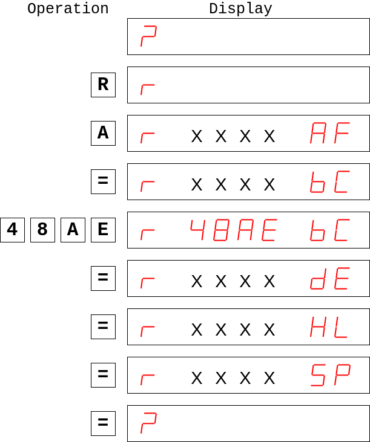

#### `MEM` - memory modification

Command:

`M` \<(address)\> `=` <(data)> `=` ...

With `M` command you can view or modify the content of the memory space. When the command is issued the following display should appear:

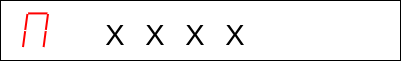

Next to the 'M' is displayed the last address. Now you can enter a new address or keep the current. By pressing `=` key you confirm the address and you can modify the value. Press `=` to store new data and go to the next address and modify data or skip to the next address by pressing `=`.

Example:

Enter the following code to address 0x1C00. This code will also be used in the following text.

```none
	[Address]	[Data]	[Instruction]
	0x1C00h		0x21	LXI H,2200h
	0x1C01h		0x00
	0x1C02h		0x22	
	0x1C03h		0x11	LXI D,3300h
	0x1C04h		0x00
	0x1C05h		0x33
	0x1C06h		0x76	HLT
```


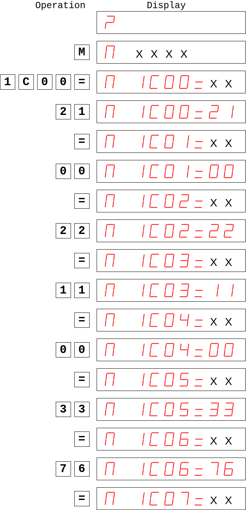

#### `GO` - program execution

Command:

`EX` \<(address)\> `=`

With `EX` command you can execute the program saved in RWM or ROM memory. When the command is issued the following display should appear:

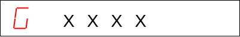

Now you can modify the address field like in the previous example and then press `=`. 
If you enter address 0x1C00 (and you have entered the code from the previous example) then the display clears and `E` is displayed in the left corner. The processor left the MONITOR and is executing user code. It is possible to return from this state by pressing `RE` or `I` (if it is enabled and the interrupt vector is entered). 

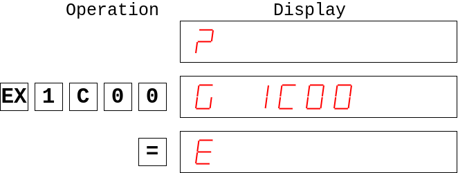

### MONITOR subroutines accesible by the user

MONITOR contains subroutines accessible to the user, i.e. they can be called from the user code. All the MONITOR subroutines are called by the instruction CALL. Subroutines are listed in the following table.

| Name | Adress | Function |
| :---: | :---: | :--- |
| CLEAR | 0x0AB | Clear display and print char to 1st place |
| ENTRY | 0x0008 | Entry to the MONITOR |
| TIN | 0x0300 | Read one byte from tape |
| TOUT | 0x02D4 | Write one byte to tape |
| OUTDA | 0x00F2 | Write one byte to output data register |
| OUTAD | 0x00BB | Write two bytes to output address register |
| MODDA | 0x00FB |  |
| MODAD | 0x00D7 |  |
| OUTKE | 0x0116 | Display string and wait for key |

Table 2. List of MONITOR subroutines

<!---
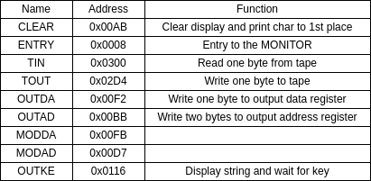
--->

#### `CLEAR` address 0x00AB

This subroutine clears 9 bytes wide output buffer and writes one character to the 1st position of the display. The character must be stored in accumulator before calling CLEAR subroutine. Display buffer pointer is stored on address 0x1FFC.

 - **Input:** 
 	- A = character to be displayed (according to the Table 1.)
 	- Display output buffer address saved in buffer pointer on address 0x1FFC
	
 - **Output:** 
 	- output buffer

 - **Used registers:** 
 	- HL, DE, A

Example:

Output buffer is located on address 0x1D00. Clear it and print character 'P' on first position.

Solution:
```
	LXI	H, 1D00h	; Output buffer address
	SHLD	1FFC		; Save buffer address to pinter
	MVI	A, 13h		; Character 'P' value
	CALL	CLEAR
```

#### `ENTRY` address 0x0008

This subroutine 

#### `TIN` address 0x0300

This subroutine is used for reading one byte from tape recorder to the register C.

 - **Input:** 
 	- data from tape recorder
	
 - **Output:** 
 	- register C

 - **Used registers:** 
 	- BC, DE, A


